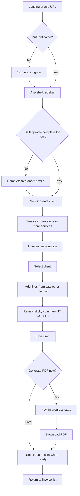
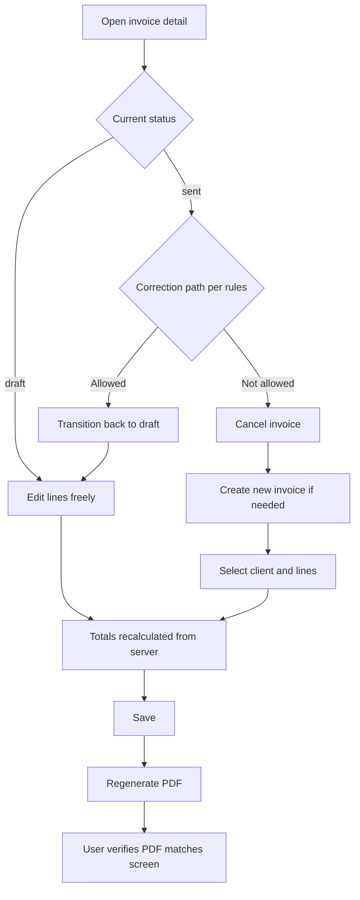
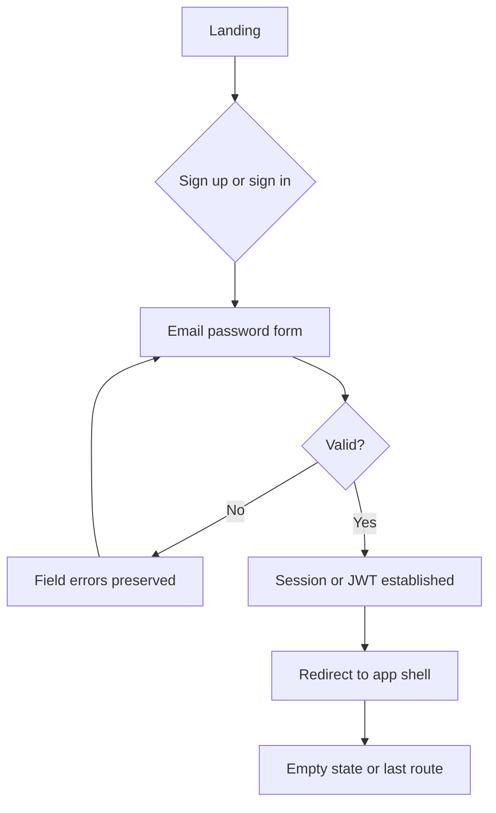

# UX Design Specification FreelanceFlow - SaaS

**Author:** Dredjib
**Date:** 2026-03-27

---

## Executive Summary

### Project Vision

FreelanceFlow is a French-market web SaaS for solo freelancers to run invoicing in one place: manage clients and reusable services (hourly HT rates), build multi-line invoices with automatic HT, VAT, and TTC in EUR, track invoice lifecycle (draft, sent, paid, cancelled), and generate downloadable PDFs that reflect server-side data—not ad hoc spreadsheets or static templates. The product prioritizes a credible, shippable V1 (clear scope, strong engineering practices) while staying honest about which legal and fiscal fields are implemented versus deferred.

### Target Users

Primary users are French freelancers (e.g. developers, consultants) who need repeatable, trustworthy billing without becoming tax experts. They are moderately tech-savvy, use the product mainly in the browser (desktop-first for serious invoicing), and value speed, clarity, and alignment between what they see on screen and what clients receive as PDF. Secondary “users” include course evaluators who must verify end-to-end flows and API documentation in production-like environments.

### Key Design Challenges

- **Monetary and tax clarity:** Present HT, VAT rate, VAT amount, and TTC so users can validate totals before issuing or sending, without overwhelming forms.
- **Status-driven editing:** Make allowed actions (edit lines, change status, cancel, recreate) obvious and consistent with backend transition rules, including recovery paths when something was sent in error.
- **Trust and compliance framing:** Use copy and empty states that match the real V1 scope (mandatory invoice fields implemented, optional identifiers such as SIRET/VAT when applicable) and avoid implying legal certification beyond the product’s rules.
- **Perceived performance and errors:** PDF generation and network calls need visible progress and mapped API errors to clear, actionable French UI messages.

### Design Opportunities

- **Seller profile completeness:** Guide new users to complete freelancer profile fields needed for invoices/PDF early, reducing “blocked at PDF” moments.
- **Snapshot semantics:** Where invoice lines copy service data at issue time, the UI can briefly explain that catalog changes do not rewrite past invoices—building confidence in archived documents.
- **France-first patterns:** EUR-first display, sensible date and address formatting, and a reasonable accessibility baseline on primary flows reinforce the product’s positioning and evaluator-facing quality.

## Core User Experience

### Defining Experience

The defining experience is the **invoice loop**: select a client, add one or more lines (from the service catalog or equivalent), see **HT, VAT, and TTC** update automatically in **EUR**, set or transition **status** according to business rules, then **generate and download a PDF** that matches persisted data. Getting this loop right—accurate, fast to scan, and trustworthy—carries the product’s core value; supporting CRUD for clients and services exists to feed that loop with minimal friction.

### Platform Strategy

**Responsive web application** delivered as a SaaS (Next.js frontend, NestJS API). **Primary input:** mouse and keyboard on **desktop** for heavy invoicing; **tablet/phone** usable for review and light edits where feasible. **No offline requirement** for V1. **Network-dependent** flows (save, PDF) must communicate **loading and failure** clearly. **HTTPS** in non-local environments is assumed.

### Effortless Interactions

- **Automatic totals:** Line amounts and invoice **HT / VAT / TTC** recalculate without manual spreadsheet work; users only adjust quantities, descriptions, or rates where editing is allowed.
- **Reusing catalog data:** Picking a **service** to prefill line description and **unit HT price** (with overrides when status allows) reduces repetitive typing.
- **Clear affordances for status:** Allowed next actions (e.g. move to sent, mark paid, cancel) are visible and aligned with the backend transition matrix.
- **Low-friction validation:** Field-level errors and summaries help fix issues **without** wiping the rest of the form.

### Critical Success Moments

- **PDF parity:** The user opens the downloaded PDF and recognizes **the same numbers, client, and lines** as on the invoice detail screen—this is the main “this works” moment.
- **First successful invoice:** Completing **signup → first client → first lines → draft/sent → PDF** in a single session validates the product promise.
- **Recovery from mistakes:** When a line or status was wrong, the user finds a **clear path** (per implemented rules) to correct or replace the invoice without contradictory documents.
- **Evaluator-ready clarity:** Primary flows are **obvious** enough for a reviewer to exercise the app in production without guesswork.

### Experience Principles

1. **Server-backed truth:** Displayed monetary values and PDF content reflect **authoritative backend state**, not client-only calculations.
2. **Status-first UX:** What can be edited, and which actions are available, **follow invoice status** and are explained in the UI when non-obvious.
3. **Progressive clarity:** Show **summaries** (totals, status) prominently; expose **VAT breakdown** and legal-identity fields in structured steps so forms stay scannable.
4. **Honest, local tone:** French UI copy, **EUR**-first formatting, and messaging that **matches V1 scope** (implemented fields vs optional SIRET/VAT) build trust without over-claiming.
5. **Respect the wait:** Async operations (especially **PDF**) always show **progress or feedback** so the app never feels stuck.

## Desired Emotional Response

### Primary Emotional Goals

Users should feel **in control and reassured** when managing money and legal-adjacent documents: totals and VAT are **understandable**, actions match **invoice status**, and the **PDF matches the screen**. After completing a flow, they should feel **accomplished and professionally credible**—able to send or archive a document without second-guessing every figure. The product should favor **calm focus** over hype; trust comes from **clarity and honesty**, not from aggressive marketing claims.

### Emotional Journey Mapping

- **First use (signup / onboarding):** **Welcomed and oriented**—clear next steps toward “ready to invoice” (e.g. profile, first client) without drowning in empty dashboards.
- **During core invoicing:** **Focused and efficient**—the UI supports scanning amounts and lines; no fear of “breaking” data silently.
- **After PDF download:** **Relief and validation**—the file is obviously consistent with what was on screen; optional subtle confirmation reinforces success.
- **When something fails:** **Supported, not blamed**—errors are **actionable** (what failed, what to fix, data preserved where possible); no dead ends.
- **Return visits:** **Familiar and dependable**—lists and detail pages feel predictable; the product feels like a **stable tool**, not an experiment.

### Micro-Emotions

- **Confidence over confusion:** HT / VAT / TTC and rates are legible; users rarely wonder “where did this number come from?”
- **Trust over skepticism:** Copy and empty states **align with V1 scope**; optional fields (e.g. SIRET, VAT number) are framed as **optional** when applicable, not hidden tricks.
- **Accomplishment over frustration:** Completing a first invoice and PDF feels like a **milestone**, not a fight with the form.
- **Calm over anxiety:** Loading states (especially PDF) prevent the “is it broken?” panic.

### Design Implications

- **In control** → Prominent **invoice summary** (status, totals, currency); **explicit** allowed actions per status; **undo-friendly** flows where rules allow (e.g. draft edits).
- **Reassured** → **Honest** helper text about what the app does/does not certify; **consistent** EUR formatting; **server-backed** figures echoed in the PDF affordance.
- **Supported on errors** → Map API errors to **short French messages** with **next step**; preserve form state when validation fails.
- **Accomplished** → Clear **success feedback** after PDF generation or status change; avoid noisy celebration—**professional** tone fits freelancers.

### Emotional Design Principles

1. **Clarity beats cleverness:** Prefer obvious labels and layouts over playful ambiguity in money and legal-adjacent flows.
2. **Honesty builds trust:** UI language reflects **implemented** rules and optional identifiers; avoid implying full legal certification.
3. **Never feel abandoned:** Every error and long wait offers **feedback** and a **path forward**.
4. **Professional calm:** Visual and tonal choices support **concentration** and **credibility** (freelancer talking to clients), not entertainment-first patterns.
5. **Parity is peace of mind:** When screen and PDF **match**, the primary emotional payoff is **quiet confidence**.

## UX Pattern Analysis & Inspiration

### Inspiring Products Analysis

**Reference set (category-level, not prescriptive branding):** products freelancers often encounter that solve **money + trust + lists** well.

1. **Modern payment / billing dashboards (e.g. Stripe-style business tools)**  
   - **Strengths:** Clear **running totals**, unambiguous **status** labels, **line-item** tables that scan quickly, and **obvious primary actions** (pay, download, send—mapped here to invoice/PDF).  
   - **UX takeaway:** Treat **HT / VAT / TTC** as first-class, always visible in context of the document being edited or viewed.

2. **High-clarity SaaS productivity tools (e.g. Linear-, Notion-, or Airtable-class patterns)**  
   - **Strengths:** **List → detail** navigation, **empty states** that teach the next step, **keyboard-friendly** tables where appropriate, restrained UI chrome that keeps focus on content.  
   - **UX takeaway:** Use **predictable resource pages** (Clients, Services, Invoices) and **helpful empties** (“Add your first client to create an invoice”).

3. **French-facing freelance / accounting-adjacent UIs (e.g. indie tools such as Indy-style flows)**  
   - **Strengths:** **Local language**, **EUR** and **VAT** vocabulary that matches user mental models, **step-by-step** onboarding toward “first document.”  
   - **UX takeaway:** **French copy** and **France-relevant field labels** (without over-claiming legal coverage) reinforce trust for the target market.

### Transferable UX Patterns

**Navigation**

- **Persistent app shell** (logo, account, sign out) + **section nav** for Clients, Services (prestations), Invoices, Profile/seller settings—mirrors architecture’s domain split and PRD journeys.
- **Breadcrumbs or back affordances** from invoice detail to list, and from invoice to client context when useful.

**Interaction**

- **Editable line table** on invoices: add/remove/reorder lines, pick **service** to prefill, show **per-line HT / VAT / TTC** plus **invoice rollup**—reduces spreadsheet anxiety.
- **Sticky or repeated summary** of totals while scrolling long line lists on desktop.
- **Primary + secondary actions** by status (e.g. draft: Save, Generate PDF; sent: Mark paid—exact set per transition rules).
- **Explicit loading** for PDF generation and **download** affordance once ready.

**Visual**

- **Numeric alignment** (tabular figures), **consistent EUR** formatting, **status badges** with color used sparingly for recognition—not decoration overload.
- **Form density** tuned for **desktop**: grouped fieldsets for seller profile and client forms.

### Anti-Patterns to Avoid

- **Totals only in PDF** or **only after submit**—undermines trust; users must see **live HT/VAT/TTC** on the invoice screen.
- **Silent failures** or generic “Error” on save/PDF—conflicts with emotional goals and NFRs; use **mapped, actionable** messages.
- **Client-only tax math** that disagrees with server—violates architecture and PRD parity.
- **Cryptic status** with no explanation of **what can be edited**—increases errors and support burden.
- **Overwhelming legal walls** of text on every screen—prefer **short, honest** scope notes and links to README/docs where appropriate.

### Design Inspiration Strategy

**Adopt**

- **List/detail** patterns for each resource with **filters or sort** on invoice list when volume grows (even minimal V1: sort by date/status).
- **Invoice line editor + live totals** pattern from strong billing UIs.
- **Empty states** that point to the **next concrete action** (profile, client, first invoice).

**Adapt**

- **Simpler than full accounting suites:** no chart of accounts, no multi-entity—keep **one freelancer, one account** focus; avoid enterprise nav depth.
- **French market copy** and **field sets** aligned with **V1 schema** (optional SIRET/TVA clearly optional when product says so).

**Avoid**

- **Gamification** or playful metaphors around **tax and invoices**—conflicts with **professional calm** emotional goals.
- **Dark patterns** (hidden fees, fake urgency)—irrelevant to V1 and harmful to trust.
- **Mobile-first complexity** that sacrifices **invoice table usability** on desktop—responsive yes, but **prioritize desktop** for authoring.

*Note: Product names above are **illustrative categories**; implementation should not copy proprietary visual identity—only **interaction and information patterns**.*

## Design System Foundation

### 1.1 Design System Choice

**Radix UI** as the **primary UI foundation**: **Radix Primitives** (`@radix-ui/react-*`) for accessible, unstyled behavior (dialogs, dropdowns, tabs, tooltips, select, etc.), composed into **FreelanceFlow-specific** styled components in the Next.js repo.

**Styling layer:** **Tailwind CSS** (recommended alongside Next.js) to implement layout, density, and **theme tokens** mapped from CSS custom properties.

**Optional accelerator:** **Radix Themes** (`@radix-ui/themes`) may be used for **global layout primitives** (`Theme`, `Text`, `Box`) and its **built-in scaling**—but **multi-color themes** are still defined explicitly below so several **brand/accent palettes** remain first-class, not a single fixed look.

### Rationale for Selection

- **Accessibility:** Radix Primitives handle **focus management, keyboard interaction, and WAI-ARIA** patterns—aligned with NFR-A1 and primary flows (forms, menus, modals).
- **Unstyled by default:** Teams own **visual design** while keeping proven interaction models—fits **professional invoicing** and **French-market** copy without inheriting another product’s chrome.
- **Multi-theme requirement:** Primitives do not lock a single palette; **semantic tokens** (e.g. `--background`, `--primary`, `--destructive`, `--muted`) can be **swapped per theme** for multiple color experiences.
- **Architecture fit:** Matches the documented structure (`src/components/ui/` for primitives wrappers, `src/components/features/` for domain composition).

### Implementation Approach

1. **Install Radix Primitives** per component need (avoid importing the entire ecosystem blindly—add primitives as features require them).
2. **Wrap each primitive** in a small **UI component** (e.g. `Button`, `Dialog`, `DropdownMenu`) in `src/components/ui/`, applying **Tailwind** classes that read **CSS variables**—never hard-code one-off hex values in feature code.
3. **Theme switching:** Expose **multiple named themes** (e.g. `default`, `ocean`, `forest`, `high-contrast`) as sets of variables:
   - Scope variables on **`document.documentElement`** or a root layout wrapper via **`data-theme="<name>"`** (or `class` strategy), e.g. `[data-theme="ocean"] { --primary: …; --primary-foreground: …; … }`.
   - Persist user choice in **`localStorage`** (and optionally respect `prefers-color-scheme` for **light/dark** *within* each color theme if desired).
4. **Radix Colors (optional):** Use [@radix-ui/colors](https://www.radix-ui.com/colors) **scales** as a **consistent source** for each theme’s palette (stepped 1–12 per hue), mapped into semantic tokens—keeps **several color themes** harmonious without manual guesswork.
5. **Light / dark (optional V1+):** Each **color theme** can define **both** `light` and `dark` variable sets under the same `data-theme`, or use `data-appearance="light | dark"` layered with `data-theme` for **combinatorial** control (e.g. “Ocean + dark”).
6. **Forms:** **React Hook Form** + **Zod** for client-side validation where helpful; **Nest DTOs** remain authoritative.

### Customization Strategy

- **Semantic tokens only in features:** Feature components use **`bg-primary`, `text-muted-foreground`, `border-border`, etc.** (or equivalent utility mapping)—never raw palette step names in invoice or client screens.
- **Tabular figures:** Apply **`font-variant-numeric: tabular-nums`** to monetary columns and totals for **EUR** alignment.
- **Theme catalog:** Document **at least two** distinct color themes in the README or Storybook (if used): e.g. **neutral professional** (default) and **alternate accent** for demos or user preference—expandable to more themes without refactors as long as tokens stay semantic.
- **Contrast:** Verify **focus rings** and **destructive/error** colors meet readable contrast **per theme**; **high-contrast** theme should be one of the named presets if evaluators or users need it.
- **French UI:** All strings in French; **dates/numbers** via `Intl` consistent with architecture (API UTC, display localized).

**Alternatives noted:** A **single** third-party kit (e.g. MUI) would bundle opinionated styles and complicate **multiple first-class color themes** without heavy overrides—**Radix + tokens** keeps theme swaps localized to variable sets.

## 2. Core User Experience

### 2.1 Defining Experience

The defining experience users will describe in one sentence is: **“I built a correct French invoice with the right HT, TVA, and TTC, and downloaded a PDF that matches what I saw—without fighting a spreadsheet.”** If this loop is flawless—**client + lines + live totals + status + PDF parity**—the product feels indispensable; everything else (directory of clients, catalog of services, profile) exists to make that loop fast and repeatable.

### 2.2 User Mental Model

Users arrive with a **document mental model**: an invoice is a **formal paper-like object** with a seller, a buyer, lines, and a bottom-line **TTC**. They often substitute **Excel + template** or **Word**, expecting **manual VAT math** or fragile formulas. They expect **EUR**, **clear labels** (HT / TVA / TTC), and that **“sent”** means something committed to a client—even if sending happens outside the app in V1. Confusion spikes when **totals move without explanation**, when **status does not match what they can edit**, or when the **PDF disagrees** with the screen. FreelanceFlow should feel like a **serious tool**, not a toy: predictable lists, explicit actions, and **honest** copy about what is optional (e.g. SIRET) versus required.

### 2.3 Success Criteria

- **“It just works”:** After adding or changing lines, **HT, VAT, and TTC** update immediately and match **backend persistence** after save.
- **Smart accomplishment:** The user recognizes **invoice number, dates, client, and lines** on screen and sees the **same** in the PDF without reconciliation.
- **Right feedback:** Validation is **field-level**; long operations (**PDF**) show **progress**; success states are **clear but professional** (no gimmicks).
- **Speed perception:** Lists and detail views feel **snappy**; PDF is allowed to be slower if **communicated**.
- **Automation:** **Tax line amounts** and invoice rollups are **computed by the system**; the user adjusts **business inputs** (quantities, rates, VAT rate where applicable), not spreadsheet formulas.

### 2.4 Novel UX Patterns

The core loop is **mostly established SaaS + billing UX**: **list/detail**, **editable tables**, **primary actions**, **status badges**. What is **distinct** is not a new gesture but **jurisdiction- and honesty-first framing**: French labels, **EUR**, optional legal identifiers clearly marked, and **no false compliance claims**. Innovation is **combinatorial**: familiar patterns + **strict parity** (UI ↔ PDF ↔ API) + **status-gated editing** explained in the UI. **No novel gesture** requiring user education (no swipe-to-invoice); if anything needs explanation, use **short inline help** (e.g. snapshot lines vs catalog services) rather than a new interaction paradigm.

### 2.5 Experience Mechanics

**1. Initiation**

- User opens **Invoices** → **New invoice** (or empty state CTA). System may prompt **seller profile** or **first client** if prerequisites are missing.
- Trigger: need to **bill** after work; recurring use: duplicate-from-pattern or new from **client**.

**2. Interaction**

- **Select client** (searchable select or link to create client).
- **Add lines:** from **service** pick (prefill description + unit HT) or manual line; set **quantity**; set or confirm **VAT rate** per product rules.
- **Edit** only when **status allows**; disabled controls show **why** (tooltip or helper text).
- **Save draft** persists server-side; **totals** always reflect saved state after refresh.

**3. Feedback**

- **Inline validation** on blur/submit; **API errors** mapped to French messages and fields.
- **Totals panel** always visible on desktop for long forms; **status** visible as badge + allowed transitions.
- **PDF:** button shows **loading**; success → **download** or open; failure → **retry** + error detail.

**4. Completion**

- User marks milestone: **PDF downloaded** or **status set to sent/paid** per workflow.
- **Next:** return to **invoice list**, or **archive** mentally; optional prompt to **add another line** or **new invoice** for power users.

## Visual Design Foundation

### Color System

- **Multi-theme architecture (required):** Several named themes (e.g. `default`, `ocean`, `forest`, `high-contrast`) implemented as **semantic CSS variables** switched via `data-theme` on the root, persisted in **`localStorage`**, aligned with **Design System Foundation** (Radix Colors scales optional per theme).
- **Semantic mapping:** All UI uses tokens—**background**, **foreground**, **muted**, **border**, **primary**, **primary-foreground**, **destructive**, **ring** (focus)—not raw hex in feature code. **Invoice status** colors map to **semantic** roles (e.g. draft = muted, sent = primary/accent, paid = success, cancelled = muted or warning—exact hues per theme).
- **Light / dark:** Optional **`data-appearance`** (or equivalent) layered with `data-theme` so each color theme can ship **light and dark** variable sets; respect **`prefers-color-scheme`** only as a **default**, not an override of explicit user choice.
- **Contrast:** Validate **text on surface**, **primary buttons**, **error states**, and **focus rings** per theme; **`high-contrast`** preset targets stricter legibility for evaluators or accessibility needs.

### Typography System

- **Tone:** **Professional, neutral, readable**—credibility for invoicing; avoid display fonts that feel playful or consumer-only.
- **Typefaces:** One **primary sans-serif** stack for UI (system UI stack or a single licensed/web font chosen by the team—e.g. **Source Sans 3**, **IBM Plex Sans**, or **Geist**—decision at implementation). Optional **second** face for marketing/landing only; **invoice tables and forms** stay on the primary stack.
- **Scale:** Modular scale for **page title, section title, card title, body, small/caption**; **body** minimum comfortable for forms (~16px equivalent) to reduce mobile zoom issues.
- **Numbers:** **`font-variant-numeric: tabular-nums`** on **all monetary columns**, totals, and invoice summaries for **EUR** alignment.
- **Hierarchy:** **Strong** headings on list pages; **restrained** chrome on dense invoice editor so **figures** dominate.

### Spacing & Layout Foundation

- **Base unit:** **4px** (or **0.25rem**) base; spacing steps **4, 8, 12, 16, 24, 32, 48** for predictable rhythm.
- **Density:** **Comfortable** padding on forms and dialogs; **slightly tighter** row height on **invoice line tables** on desktop to show more lines without scrolling.
- **Layout:** **App shell** with **left sidebar** navigation (locked: **Design Direction 1**) and **max-width content** where appropriate; **invoice editor** uses **two-column** layout on large viewports (lines + sticky totals) collapsing to **single column** on small screens.
- **Grid:** **12-column** fluid grid optional for marketing; **feature pages** rely on **consistent max-width** and **stack** patterns rather than complex grids.

### Accessibility Considerations

- **Target:** Reasonable keyboard and screen-reader support on **primary flows** (NFR-A1); **WCAG 2.1 Level A** as stretch where feasible.
- **Focus:** Visible **focus rings** on all interactive elements (Radix primitives + tokenized `ring` color); no **outline: none** without replacement.
- **Forms:** Associated **labels**, **`aria-invalid`** on errors, **announce** critical errors where appropriate.
- **Color:** Do not rely on **color alone** for status—pair **badge + text** (e.g. “Payée”).
- **Motion:** Respect **`prefers-reduced-motion`** for non-essential animations (theme transitions can instant-switch or reduce duration).

## Design Direction Decision

### Design Directions Explored

Eight static mock directions are documented in **`_bmad-output/planning-artifacts/ux-design-directions.html`** (open locally in a browser). They explore: (1) sidebar + sticky totals, (2) top nav + airy centered column, (3) dense list/table, (4) Ocean accent, (5) Forest accent, (6) high contrast, (7) card hub home, (8) minimal document-first chrome.

### Chosen Direction

**Direction 1 — Sidebar navigation + sticky invoice summary (totals rail).**  
**Confirmed by product stakeholder (overall preference):** Dredjib.

**Layout lock:** Default app shell uses a **left sidebar** for primary navigation (Factures, Clients, Prestations, Profil vendeur). Invoice **detail/edit** uses a **two-column** layout on large viewports: **line editor + table** in the main column, **HT / TVA / TTC summary** in a **sticky** right rail; on narrow viewports, the summary **stacks below** the lines.

**Theming:** Neutral chrome for the shell so **named color themes** (`default`, `ocean`, `forest`, `high-contrast`, etc.) swap via semantic tokens without restructuring layout. Directions 4–6 in the HTML showcase illustrate accent and contrast modes on similar structures.

### Design Rationale

- **Core experience fit:** Keeps roll-up totals visible while editing multiple lines—supports the defining invoice loop and PDF confidence.
- **IA alignment:** Sidebar maps cleanly to PRD domains and architecture feature areas (clients, services, invoices, profile).
- **Emotional goals:** Reinforces **control** and **clarity** (professional calm) versus experimental or entertainment-first layouts.
- **Multi-theme strategy:** Direction 1 is **theme-agnostic**; Ocean/Forest/high-contrast remain alternate `data-theme` presets rather than separate layout forks.

### Implementation Approach

- Next.js **root layout**: persistent **sidebar** + **main** content region; active nav state per route.
- Invoice routes: **responsive grid** — `lg+`: main + sticky aside; below `lg`: single column, summary after lines or in a collapsible panel if needed.
- Preserve **`ux-design-directions.html`** as stakeholder reference; implementation tokens should follow **Radix + CSS variables** from **Design System Foundation**.
- Optional later: **card hub** patterns from Direction 7 as a **dashboard/home** enhancement post-V1 if backlog allows—not part of the locked V1 shell.

## User Journey Flows

Flows below extend PRD personas **Sophie** (happy path), **Mehdi** (correction), and shared **authentication** entry. Shell layout follows **Design Direction 1** (sidebar + invoice sticky summary).

### Journey A — First invoice to PDF (Sophie / happy path)

**Goal:** Register (or sign in), prepare **seller profile** if needed, create **client** and **services**, build an **invoice** with live **HT / VAT / TTC**, save as **draft**, optionally **generate PDF**, then move to **sent** when ready.

**Notes:** Empty states on **Clients** / **Services** should CTA into creation before **Invoices**. **PDF** must show loading; failure path → toast/inline error + retry.

### Journey B — Correcting an issued invoice (Mehdi / edge path)

**Goal:** Fix a mistake on an invoice that is no longer a simple **draft**—following **product transition rules** (revert to draft, **cancel** and recreate, etc.—exact matrix is backend/product owned).

**Notes:** UI must **disable** illegal actions and explain **why** (tooltip or inline). **Cancelled** state should be clearly labeled; list filters may hide cancelled by default (product choice).

### Journey C — Authentication entry

**Goal:** Low-friction **sign up** and **sign in** with clear validation; redirect into **shell** toward first value action (profile or clients).

### Journey Patterns

- **Shell + resource CRUD:** Sidebar → list page → **primary button** → form (modal or page) → return to list with **toast or inline success**.
- **Sticky financial summary:** Present on **invoice create/edit** (Direction 1) so users never scroll blindly for **TTC**.
- **Status-driven UI:** **Primary actions** change by **invoice status**; same pattern reusable if other entities gain state later.
- **Async feedback:** **PDF** and **save** use **loading** + **error recovery**; forms retain **unsaved** context where the API allows.

### Flow Optimization Principles

- **Minimize steps to first PDF:** Prefer **inline prompts** (profile completeness, missing client) over dead-end dashboards.
- **Reduce cognitive load:** One **main decision** per screen (pick client → then lines); avoid blocking modals unless validation requires it.
- **Honest progress:** Users always know **what happened** (saved, sent, PDF ready, failed)—aligned with emotional design goals.
- **Recovery first:** Validation and API errors point to **fix** without wiping unrelated fields.

## Component Strategy

### Design System Components

**Radix UI primitives** (installed incrementally) wrapped as **local UI components** with **Tailwind + semantic tokens**:

- **Layout & chrome:** `Dialog`, `DropdownMenu`, `Tabs`, `Tooltip`, `Separator`, `ScrollArea` (if needed for long line tables).
- **Forms:** `Label`, `Slot`-based patterns for inputs; compose with **React Hook Form** + **Zod** for validation display.
- **Feedback:** `Toast` pattern (Radix Toast or equivalent) for save/PDF outcomes; inline `Alert` for persistent messages.
- **Overlays:** `Dialog` for destructive confirms (cancel invoice) and optional quick-create client from invoice flow.
- **Selection:** `Select` or `Combobox` pattern for **client** and **service** pickers.

These cover **80%+** of interactive atoms; **tables** may use **semantic `<table>` + styled rows** or a lightweight table helper—avoid heavy data-grid unless backlog demands.

### Custom Components

#### `InvoiceLineTable` (or `InvoiceLinesEditor`)

**Purpose:** Add, remove, reorder, and edit **invoice lines** with **per-line HT, VAT rate, line totals** and **EUR** formatting.  
**States:** loading skeleton, editable (draft), read-only (sent/paid per rules), empty (no lines), row error.  
**A11y:** row headers, keyboard navigation for inputs, announce row add/remove where useful.

#### `InvoiceTotalsPanel` (sticky rail)

**Purpose:** Show **HT, VAT, TTC**, currency **EUR**, and **status** badge—mirrors server totals after save.  
**States:** live preview before save vs **confirmed** after refresh; loading during refetch.  
**A11y:** region landmark or heading “Synthèse”; values as text with **tabular nums**.

#### `InvoiceStatusActions`

**Purpose:** Expose **allowed transitions** (draft → sent → paid, cancel, etc.) as **primary/secondary** buttons with **disabled + reason**.  
**States:** default, loading on mutation, error with retry.  
**A11y:** buttons have explicit French labels; destructive actions open **confirm Dialog**.

#### `ResourceEmptyState`

**Purpose:** Empty list CTA for **Clients**, **Services**, **Invoices** with **one primary action** and short copy.  
**Variants:** first-time vs “no results after filter” (V1 may skip filter).

#### `ThemeSwitcher`

**Purpose:** Switch **`data-theme`** presets (`default`, `ocean`, `forest`, `high-contrast`); optional **appearance** toggle.  
**Placement:** header or settings; persist **`localStorage`**.

#### `MoneyDisplay`

**Purpose:** Consistent **EUR** formatting and **tabular figures** everywhere amounts appear (lists, PDF CTA area, summaries).

### Component Implementation Strategy

- **Colocate** primitives in `src/components/ui/`; **domain** compositions in `src/components/features/{clients,services,invoices}/`.  
- **No raw Radix** imports inside feature folders—only **wrapped** components to enforce tokens and copy patterns.  
- **Server components** for static shells where possible; **client** for line editor, theme switcher, PDF button.  
- **Storybook** optional for V1; minimum **one visual reference** (`ux-design-directions.html` + README) for layout.

### Implementation Roadmap

**Phase 1 — Unblock core journeys**

- Auth pages (form layout + errors).  
- `ResourceEmptyState`, client/service **forms**, **lists**.  
- `InvoiceLineTable`, `InvoiceTotalsPanel`, `InvoiceStatusActions`, **PDF** trigger with loading.

**Phase 2 — Polish & resilience**

- Toasts, confirm dialogs, **ThemeSwitcher**, improved **Select/Combobox** for many clients.  
- Table **sort** on invoice list (minimal).

**Phase 3 — Optional enhancements**

- Keyboard shortcuts, duplicate invoice, dashboard cards (Direction 7)—**post-MVP** unless scoped in.

## UX Consistency Patterns

### Button Hierarchy

- **Primary:** One per view for the **main forward action** (e.g. **Enregistrer**, **Générer le PDF**, **Créer une facture**)—filled style using **`--primary`** token.
- **Secondary:** Alternative safe actions (e.g. **Annuler** edition, **Retour** to list)—outline or ghost; never competes visually with primary.
- **Destructive:** **Annuler la facture**, **Supprimer**—always **Dialog confirmation** + clear French copy; use **`--destructive`** token.
- **Tertiary / link:** Low-emphasis navigation (“Voir le client”, “Ajouter une prestation”)—text or subtle button.
- **Disabled:** Explain via **tooltip** or **helper text** when action blocked by **status** or **permissions**—never silent disable without reason.

### Feedback Patterns

- **Success:** Short **toast** for **save**, **status change**, **PDF ready**; avoid stacking duplicate toasts for the same event.
- **Error (API):** **Toast** or **inline alert** at top of form with **actionable** French message; map `code` from Nest error shape when available.
- **Error (validation):** **Field-level** messages + optional summary list; preserve **non-invalid** field values.
- **Warning:** Use for **irreversible** or **legal-adjacent** cautions (e.g. cancel invoice)—inline or Dialog body.
- **Info:** **Inline helper** under fields (SIRET/TVA optional, VAT rate)—not modal unless onboarding.
- **Loading:** **Spinner + disabled** control or **skeleton** on lists; **PDF** shows explicit **“Génération en cours…”** state.

### Form Patterns

- **Labels** always visible (not placeholder-only); **required** marked with text or aria.
- **Order:** Identity → context → amounts; **invoice** = client → dates/number → lines → totals (read-only in panel).
- **Submit:** Explicit **submit** button; **Enter** submits single-focus forms; multi-section invoice relies on **Save** not auto-submit on blur (avoid accidental partial saves—product may still autosave draft later if scoped).
- **Formats:** **EUR** and **dates** displayed with **French locale**; internal values still ISO for API.

### Navigation Patterns

- **Sidebar:** Persistent; **active** section highlighted; **same items** for all authenticated pages (Direction 1).
- **List → detail:** Click row or **primary** “Ouvrir”; **back** returns to list preserving **scroll** where trivial.
- **Deep links:** Invoice URL bookmarkable; **404** if wrong tenant (handled by API).

### Additional Patterns

- **Empty states:** One **headline**, one **sentence**, one **primary CTA** (`ResourceEmptyState`).
- **Modals:** Use for **destructive confirm** or **quick create**; avoid **invoice line editor** entirely in modal on desktop—prefer full page for density.
- **Tables:** **Header row** sticky optional; **numeric columns** right-aligned with **tabular nums**; **status** column uses **badge + text**.
- **Theme:** **ThemeSwitcher** in header/settings; switching **does not** reset form state.
- **Search/filter (V1 optional):** If invoice list grows, **single search** field or **status filter** chips—same pattern as future client search.

## Responsive Design & Accessibility

### Responsive Strategy

- **Desktop-first (authoring):** Primary experience targets **≥1024px**: **sidebar** + **invoice two-column** (lines + sticky totals). Use width for **dense line tables** and **always-visible** HT/VAT/TTC summary.
- **Tablet (768–1023px):** **Sidebar** may collapse to **icon rail** or **drawer** (team choice); invoice **summary** stacks **below** lines or becomes a **collapsible** panel at top. Touch targets per accessibility below.
- **Mobile (≤767px):** **Single column**; **hamburger or bottom** pattern for nav (pick one and stay consistent). **Invoice:** lines first, **totals** block after; **PDF** and **save** remain **full-width** primary actions. **Review** and light edits acceptable; **heavy data entry** is secondary on mobile for V1.

### Breakpoint Strategy

- Align with **Tailwind defaults** unless the team standardizes otherwise: **`sm` 640px**, **`md` 768px**, **`lg` 1024px**, **`xl` 1280px**.
- **Critical switch:** **`lg`** — activate **two-column invoice** + persistent **sidebar**; below **`lg`**, stack layout and optional drawer.
- **Fluid type:** Prefer **rem**-based spacing and type; avoid fixed pixel widths for main content—use **max-width** containers for readability.

### Accessibility Strategy

- **Target:** **WCAG 2.1 Level A** as **minimum** for primary flows (per PRD NFR-A1); **Level AA** for **color contrast** on text and UI components where feasible—especially **default** and **`high-contrast`** themes.
- **Keyboard:** All interactive controls reachable in logical order; **Radix** primitives provide baseline focus management for dialogs/menus—verify **custom** table cell focus.
- **Screen readers:** **Semantic** headings per page; **live region** or **aria-live** for **PDF generation** result; **invoice status** not conveyed by color alone (**badge + text**).
- **Forms:** **Labels** tied to inputs; **`aria-invalid`** + **`aria-describedby`** for errors.
- **Motion:** Honor **`prefers-reduced-motion`** for transitions (theme toggle, drawer).
- **Touch:** Minimum **44×44px** tap targets for mobile **nav** and **primary** actions.

### Testing Strategy

- **Responsive:** Manual check at **375**, **768**, **1024**, **1440** widths; **Safari iOS** + **Chrome Android** for auth and invoice read path.
- **Cross-browser:** **Chrome, Firefox, Safari, Edge** on desktop for **PDF** download and **layout**.
- **A11y automation:** **axe** or **Lighthouse** in CI on **key routes** (login, invoice detail) as stretch—at minimum pre-release manual pass.
- **Screen reader spot-check:** **VoiceOver** (macOS/iOS) or **NVDA** (Windows) on **login**, **invoice create**, **PDF** button flow.
- **Keyboard:** Tab through **sidebar**, **form**, **dialog** confirm, **line table** without mouse.

### Implementation Guidelines

- **Semantic HTML:** `main`, `nav`, `header`, `table` with **`th`/`td`** for invoice lines; **landmarks** for sticky totals region.
- **Focus visible:** Use design-token **`ring`**; never remove outline without replacement.
- **Relative units:** spacing and typography in **rem**; tables **horizontal scroll** wrapper on narrow screens if needed instead of squashing columns.
- **Images/icons:** Decorative icons **`aria-hidden`**; icon-only buttons need **`aria-label`** (French).
- **Theme `high-contrast`:** Validate **contrast** for text, buttons, and **focus**; treat as part of **regression** when changing tokens.
